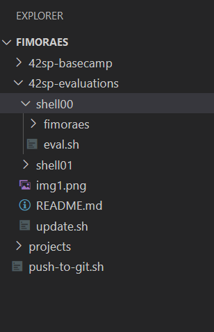

# Objetivo
O objetivo deste repositório é otimizar o tempo das avaliações peer-to-peer. Dessa forma podemos focar mais na pessoa e nas soluções apresentadas. 
## Como assim?
Normalmente perdemos muito tempo nas avaliações com preparos, por exemplo, ter varios main.c prontos para cada exercício, ficar compilando os códigos, verificando se está tudo certo com a norminette.  
Esses scripts não dispensam que converse com a pessoa sendo avaliada e não dispensa que olhe o código da pessoa e questione o que foi feito.
### E então pra que serve?
Serve para acelerar o processo de avaliação.  
Com as listas de C, por exemplo, testo os arquivos submetidos se estão passando pela norminette e uso alguns arquivos main.c de referência para já testar se o código compila, também testo o binario gerado para saber se funcionou com o resultado esperado.
## O que está por vir?
Estou reunindo alguns outputs de referência para fazer comparações e deixar ainda mais simples.  
Pretendo em breve unificar os scripts para virarem 1 único script capaz de verificar tudo.
# Como preparar o ambiente
Após clonar esse repositório rode o script first-time.sh
```shell
bash first-time.sh
```
# Como usar o script
Basta navegar no terminal para a lista que deseja avaliar e rodar o script passando o nome de usuário e o link do git a ser avaliado.
Exemplo abaixo:

Shell00
```shell
cd shell00
./eval.sh fimoraes git@vogsphere-v2.42sp.org.br:vogsphere/intra-uuid-6065b583-76ec-4541-85ee-4fd89f109a33-3580828
```
Shell01
```shell
cd shell01
./eval.sh fimoraes git@vogsphere-v2.42sp.org.br:vogsphere/intra-uuid-6065b583-76ec-4541-85ee-4fd89f109a33-3580828
```
C
```shell
cd c
./eval.sh
```
# Como atualizar
Através do terminal navegue até o diretório onde clonou esse git e execute o script update.sh
```shell
bash update.sh
```
# Exemplo de como me organizei

# FAQ
## Mas não tem problemas eu clonar o repositório do amiginho dentro dessa pasta?
> R.: Não, esse repositório possui um .gitignore que já cuida disso :smile:
## De onde veio a idéia?
> R.: Esses dias encontrei o repositório [fake-moulinnete](https://github.com/eduardomosko/fake-moulinnete) e gostei da idéia, mas ainda tinha muita coisa manual, desde então estou criando essa versão personalizada :smile:
# TO:DO
- Montar outputs de referência para melhorar os testes
- Fazer com que todos os scripts se tornem 1 só :smiling_face_with_three_hearts:
- Fazer melhorias (sempre :smile:)
